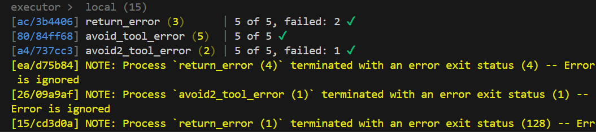
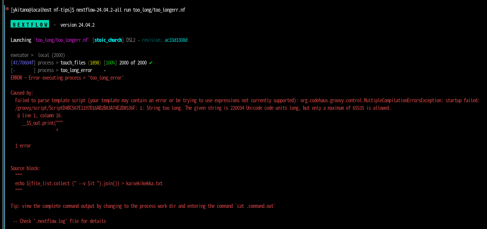
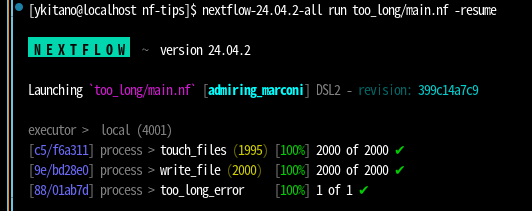

# README

これはNextflowを実行した際に遭遇した問題とその回避策についてのメモです。

(English Follows)

### (1) 解析ツールがエラーを返す場合と解析サーバーがエラーを返す場合の区別がつかない。
例えば、GATK fingerprintMetrics等を実行した時や、VCF Validatorを実行し、検体やファイルに異常がある場合は何度再実行してもエラーが解消されませんが、ノードエラーの場合は再実行によりエラーなく解析完了できるためnextflowで再実行してほしいと思います。

#### 解決策->  スクリプトにエラーハンドリングを記述する
   - error_code/main.nf

##### 試し方：
   -  nextflowをインストールする
   - このリポジトリをcloneする
   ``` git clone https://github.com/ykitanob/nf-tips.git```
   - 実行コマンド
   ``` nextflow error_code/main.nf ```
   
##### 実行結果：
   

 - proc1: return_error 
 
 5つのジョブのうち、２つがエラーになります。validationツールなどが異常を検出した場合に返すexit code(4としました)と、計算ノードの異常など（再実行すれば解消されるはずのエラー、128としました）です。この2つのエラーの種類が区別されず、nextflowのプロセスが「fail」になります。
 - proc2: avoid_tool_error

上記の5つのジョブのすべてがnextflowで正常終了します。
```${command} || exit 0```を記述することでコマンド実行が失敗した場合も正常終了のシグナルを発信するためです。

- proc3: avoid_tool_error2

計算ノードの異常など（再実行すれば解消されるはずのエラー、128としました）の場合は、エラーコードをそのまま返し、nextflowのワークフロー上は再実行されます。
```trap 'if [[ \$? -ge 3 && \$? -le 124 ]]; then exit 0; else exit \$?; fi' ERR```をスクリプトの先頭に入れます。

このワークフローはテストのためにわざとエラーコードを返しているため、再実行しても最後までエラーになるので、
```errorStrategy "ignore"```としています。実際の解析では```errorStrategy 'retry'```とするとよいでしょう。


### (2) Groovyには「string too long」という既知のエラーがあります。
例えば、私の場合は、jointgenotypingを実行する際にこのエラーに遭遇しました。
500ファイル程度なら問題ないですが、1000ファイル近くのg.vcf（とg.vcf.tbi）を指定するとエラーになってしまいます。

https://github.com/nextflow-io/nextflow/issues/4689
### この現象は私のパラメータ指定の問題だった可能性があります！
- プロセスの実行コマンドを```script```キーワードの後に記述するようにすればこの問題は発生しませんでした
- ```shell```キーワードを使用するとこのエラーが発生したので、このtipsは、どうしても```shell```が使いたい場合には有効かもしれないので、記載しておきます。

#### 解決策 -> MaxFork1を指定して動的にリストを生成するプロセスを追加する

- too_long/too_longerr.nf

   エラーを再現するためのワークフロー（Nextflow 24.02, 23.10 で再現することを確認しました）
   解析IDのリストのファイルを読み込みます。

- too_long/main.nf

   エラーを回避するために作成されたワークフロー。インプットファイルのリストを生成します。

##### 試し方：
   -  nextflowをインストールする
   - このリポジトリをcloneする
   ``` git clone https://github.com/ykitanob/nf-tips.git```
   - 実行コマンド（エラー発生）   ``` nextflow too_long/too_longerr.nf ``` エラーになることを確認できるはず

   - 実行コマンド（エラー回避）
   ``` nextflow too_long/main.nf ```

##### 実行結果:
   - エラー発生


   - エラー回避
   


-----
# README
This is a memo about the problems encountered when running Nextflow and their workarounds.
### (1) Unable to distinguish between errors returned by the analysis tool and errors returned by the analysis server.
For example, when running GATK fingerprintMetrics or VCF Validator, if there are abnormalities in the samples or files, the errors will not be resolved no matter how many times you rerun them. However, if it's a node error, rerunning it will allow the analysis to be completed without errors, so I would like you to rerun it with Nextflow.
#### Solution -> Add error handling to the script
   - error_code/main.nf
##### How to try:
   - Install Nextflow
   - Clone this repository
   ``` git clone https://github.com/ykitanob/nf-tips.git```
   - Run the command
   ``` nextflow error_code/main.nf ```
   
##### Execution result:
   
 - proc1: return_error 
 
 2 out of 5 jobs will result in an error. The exit codes used for abnormal detection by validation tools (set to 4) and abnormalities in computing nodes (errors that should be resolved by rerunning, set to 128) are not distinguished, and the Nextflow process will "fail".
 - proc2: avoid_tool_error
All 5 jobs will be completed successfully with Nextflow.
This is because ```${command} || exit 0``` is used to send a successful completion signal even if the command execution fails.
- proc3: avoid_tool_error2
In the case of abnormalities in computing nodes (errors that should be resolved by rerunning, set to 128), the error code is returned as it is, and the workflow in Nextflow is rerun.
Put ```trap 'if [[ \$? -ge 3 && \$? -le 124 ]]; then exit 0; else exit \$?; fi' ERR``` at the beginning of the script.
This workflow intentionally returns an error code for testing purposes, so it will continue to fail even if rerun. Therefore, ```errorStrategy "ignore"``` is used. In actual analysis, it is recommended to use ```errorStrategy 'retry'```.
### (2) Groovy has a known error called "string too long".
For example, in my case, I encountered this error when running joint genotyping.
It works fine with about 500 files, but if you specify nearly 1000 g.vcf (and g.vcf.tbi) files, it will result in an error.
https://github.com/nextflow-io/nextflow/issues/4689
### This phenomenon may have been caused by my parameter specification!
- If you write the execution command of the process after the ```script``` keyword, this problem does not occur.
- Since this error occurred when using the ```shell``` keyword, I will include this tip in case you really want to use ```shell```.
#### Solution -> Add a process that dynamically generates a list by specifying MaxFork1
- too_long/too_longerr.nf

   Workflow to reproduce the error (confirmed to reproduce with Nextflow 24.02, 23.10)

- too_long/main.nf

   Workflow created to avoid the error. It generates a list of input files.
##### How to try:
   - Install Nextflow
   - Clone this repository
   ``` git clone https://github.com/ykitanob/nf-tips.git```
   - Run the command (error occurs)   ``` nextflow too_long/too_longerr.nf ``` You should see an error.
   - Run the command (error avoided)
   ``` nextflow too_long/main.nf ```
##### Execution result:
   - Error occurs


   - Error avoided
   

